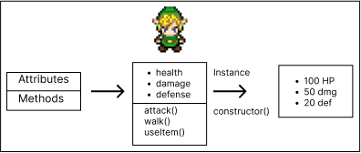
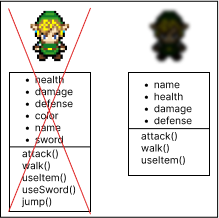
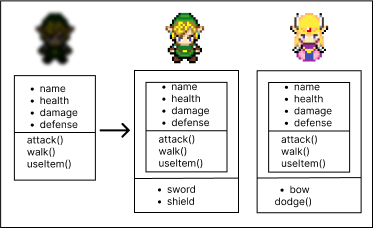
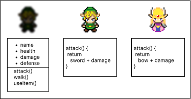

# Object Oriented Programing

It's a programming paradigm that use objects to design applications. It helps to create code that is easy to understand and reuse.
An Object contains data, ( attributes) and methods (functions), and it's defined by a class, when we create an object from a class we are creating an instance of that class.

Let's talk about some base concepts of OOP:

## Abstraction
It's the process of getting only the necessary information from an object, we have to make sure to choose the right attributes and methods to make the object reusable and easy to understand.

## Encapsulation
It's the process of controlling the access to the object's attributes and methods, we can define if an attribute or method is public, private or protected.
Usually we want to have methods to access and modify the attributes of an object, also if we have sensible properties we can make them private to avoid unwanted modifications.

## Inheritance
It's the process of reuse a class with methods and attribute without having to rewrite the code, we can create a new class that inherits from another class and add new methods and attributes to it. This helps to avoid code duplication and make the code more organized.

## Polymorphism
Allows to a method to have a different behavior according to the class that is calling it. We can have a method with the same name in different classes and it will have a different behavior according to the class that is calling it.

